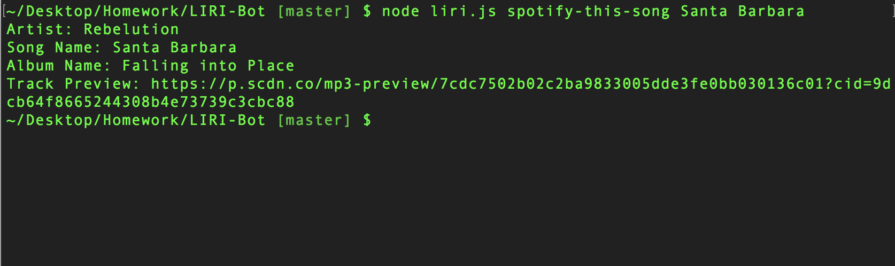

# LIRI Bot
LIRI Bot is a Language Interpretation and Recognition Interface, specializing in music and movie related questions.



# Prerequisites
LIRI Bot requires [node.js](https://nodejs.org/en/) to be installed on your machine and the ability to use [node package manager](https://www.npmjs.com/).

# Installation
LIRI Bot can be installed by downloading this repo, then navigate to your LIRI Bot directory. Within the directory run `npm install` to download all dependencies.
```
~/.../LIRI-Bot
```
```
npm install
```
Next you will need to create a `.env` file to store your Spotify API keys. Your `.env` should look like this with your keys in their respective places:
```
SPOTIFY_ID=spotify_app_id_here
SPOTIFY_SECRET=spotify_app_secret_here
```

# Running LIRI Bot
Now that you have LIRI installed you can run `node liri.js COMMAND QUERY` in your command line.

### Possible Commands
- `concert-this` followed by a musical artist as a query
- `spotify-this-song` followed by a name of a song as a query
- `movie-this` followed by a movie title as a query

# Technology
- Javascript
- [Node.js](https://nodejs.org/en/)
- [dotenv](https://www.npmjs.com/package/dotenv) - to keep API keys private
- [moment](https://www.npmjs.com/package/moment) - for time conversion
- [node-spotify-api](https://www.npmjs.com/package/node-spotify-api) - to query the Spotify API
- [request](https://www.npmjs.com/package/request) - to query OMDb and Bandsintown
- [OMDb API](http://www.omdbapi.com/) - movie database
- [Bandsintown API](http://www.artists.bandsintown.com/bandsintown-api) - concert database

# Challenges
As my first venture into node.js this was a very exciting project, but as it was my first venture with node.js there was some new concepts to tackle. The concept that was most foreign to me was packages, at first they seemed like these magical lines of code that pop out of thin air with little to no information about how they actually work. After aimlessly running a few packages I realized that I could actually open up the packages and look through the code. Once I did that it all started to come together! I'd be lying if I said I understood everything that was going on under the hood of these packages but looking through the code at least gave me a high level view of what was happening and helped me make sense of what happens when I call one them.

# Author
Craig Melville
